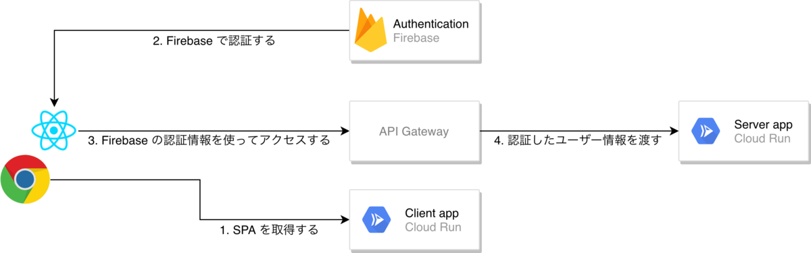

# GCP API Gateway Firebase Authentication sample

This is sample application to authenticate with Firebase Authentication.

## Build

Default `Dockerfile` contains client application and server application.
So you should only build single docker image, and deploy it.
